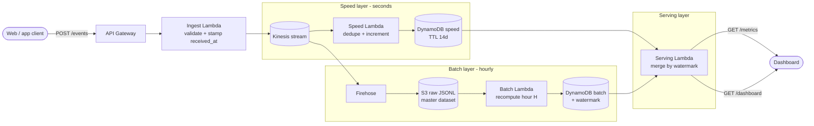
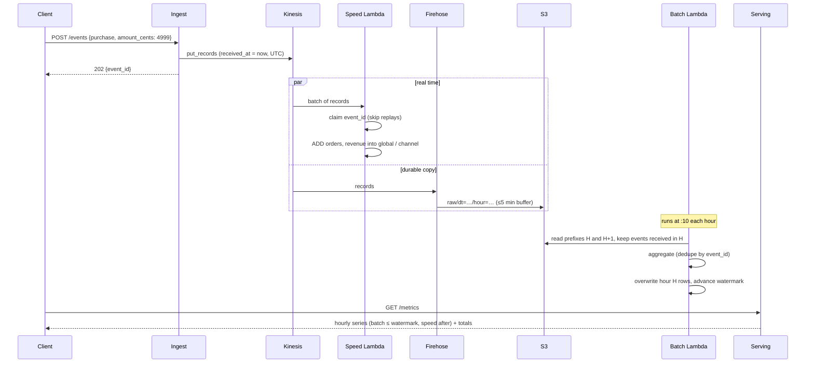

# simple-reporting

An AWS-native **lambda architecture** for e-commerce / web events. Clients POST events; the system keeps an immutable record (batch layer), maintains real-time counters (speed layer), and merges both behind one query API and dashboard.

## 1. Architecture



## 2. Life of one `purchase` event



## 3. Batch vs speed: the merge rule

The batch job stores a **watermark** (the last hour it recomputed). For every hour in a query:

- `hour <= watermark` → batch view. It is authoritative: recomputed from the raw data, so it fixes any speed-layer drift.
- `hour > watermark` → speed view: fresh, approximate until batch catches up.

Batch processes hour H only once hour H+1 has ended, because Firehose may land events received in H under the H+1 prefix.

```mermaid
gantt
    title Which layer serves each hour (now = 13:20)
    dateFormat HH:mm
    axisFormat %H:%M
    section Batch view (authoritative)
    09:00-10:00 :done, 09:00, 1h
    10:00-11:00 :done, 10:00, 1h
    11:00-12:00 :done, 11:00, 1h
    section Speed view (real time)
    12:00-13:00 (batch waits for 13:00 to end) :active, 12:00, 1h
    13:00-13:20 (current) :active, 13:00, 20m
```



Both layers use the same code (`src/common/events.py`) to bucket by server-side `received_at` and to turn events into metric deltas, so they agree by construction.

## 4. Data model

| Table | `pk` | `sk` | Attributes |
|---|---|---|---|
| speed | `global`, `channel#<c>`, `product#<id>` | hour `2026-10-07T13` | `page_views`, `add_to_carts`, `orders`, `revenue_cents`, `ttl` |
| speed | `seen` | `event_id` | `ttl` (2 days) — dedup claims |
| batch | `global`, `channel#<c>`, `product#<id>` | hour | same metrics, overwritten on recompute |
| batch | `meta` | `watermark` | `hour` — last recomputed hour |

## 5. API

### `POST /events`
One event or a list (max 100). Header `x-api-key` required if `ingest_api_key` is set.

```bash
curl -X POST "$API/events" -H "x-api-key: $INGEST_KEY" -d '[
  {"event_type":"page_view",   "session_id":"s1", "channel":"email", "product_id":"sku-1"},
  {"event_type":"add_to_cart", "session_id":"s1", "channel":"email", "product_id":"sku-1"},
  {"event_type":"purchase",    "session_id":"s1", "channel":"email", "product_id":"sku-1",
   "order_id":"o-42", "amount_cents":4999}
]'
# 202 {"accepted":3,"event_ids":["…"]}
```

| Field | Notes |
|---|---|
| `event_type` | `page_view` \| `add_to_cart` \| `purchase` (required) |
| `event_id` | optional; send one so client retries are idempotent |
| `amount_cents` | required integer ≥ 0 on `purchase` |
| `channel`, `product_id` | optional dimensions, `[A-Za-z0-9_.-]{1,64}` |
| `user_id`, `session_id`, `order_id`, `client_ts` | optional |

### `GET /metrics`
Params: `from`, `to` (ISO-8601, default last 24h, max 31 days), `channel`, `product_id`. Header `x-api-key` required if `query_api_key` is set.

```json
{
  "watermark": "2026-10-07T11",
  "dimension": "channel#email",
  "series": [
    {"hour": "2026-10-07T11", "source": "batch", "page_views": 120, "add_to_carts": 30, "orders": 9, "revenue_cents": 41200},
    {"hour": "2026-10-07T12", "source": "speed", "page_views": 97,  "add_to_carts": 21, "orders": 5, "revenue_cents": 18800}
  ],
  "totals": {"page_views": 217, "add_to_carts": 51, "orders": 14, "revenue_cents": 60000,
             "avg_order_value_cents": 4285, "cart_to_order_rate": 0.2745}
}
```

### `GET /dashboard`
Static page that polls `/metrics` every 30 s: KPI tiles, an hourly table with a batch/speed badge per row, and channel / product filters. It prompts for the query key when one is configured.

## 6. Deploy, operate, develop

```bash
cd terraform && terraform init
terraform apply -var ingest_api_key=… -var query_api_key=…
terraform output dashboard_url
```

- **Backfill / reprocess:** invoke the batch Lambda with `{"backfill_from": "2026-10-01T00"}`. Safe to repeat; the watermark never moves backwards.
- **Develop:** `pip install -r requirements-dev.txt && pytest` (tests run against `moto`).
- **CI:** `.github/workflows/ci.yml` runs pytest and `terraform fmt -check` + `validate`. The Terraform has not yet been applied to a real account.

## 7. Known limits

- Hourly granularity; dimensions are filters, not group-bys or top-N (add a GSI or Athena for those).
- The batch Lambda reads S3 directly (15 min cap). For high volume, swap `read_hour` for Athena/Glue — the output contract stays the same.
- Speed dedup stores one item per event for 2 days.
- The `/dashboard` shell is public by design; data is behind `query_api_key`. Use a real authorizer (Cognito/JWT) for production.
- High-cardinality dimensions multiply DynamoDB writes (one per dimension per event).
